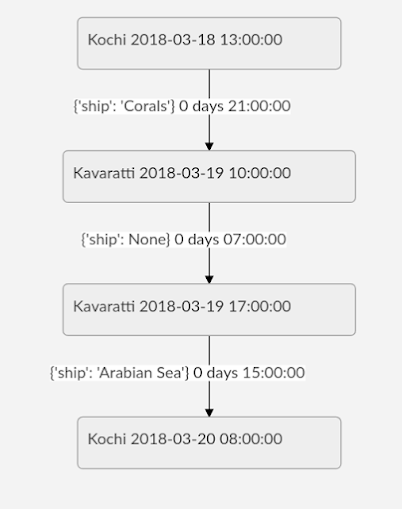

---

---

<h1 id="project-lakshadweep-itinerary">Project Lakshadweep Itinerary</h1>
<h2 id="introduction">Introduction</h2>

<a href="https://en.wikipedia.org/wiki/Lakshadweep">Lakshadweep</a> is a group of islands off south western coast of India, and has a lots of scenic and <a href="https://www.google.co.in/search?q=lakshadweep&amp;source=lnms&amp;tbm=isch">Beautiful Untouched Beaches</a> and <a href="https://www.google.co.in/search?q=lakshadweep+Lagoons&amp;source=lnms&amp;tbm=isch">Lagoons</a> worth exploring. The Islands are open to Tourists under permit from the Administrative Officer (<a href="mailto:lk-secadm@nic.in">email</a>). The mode of transport however, is limited to Govt. operated Ships that mainly ply between Mainland India (Kochi and Mangalore port) and the islands of Lakshadweep. The prime purpose of these Ships is to satisfy the needs of the Islanders that depend solely on supplies from Mainland India. Hence, the Ship Schedule is mostly dependent on the Cargo needs of each Island and is prepared fresh every month and frequency is very low. The seat availability is very limited and gets filled within a couple of days of Ship Schedule announcement for any given month. 
There is a Daily Flight from <a href="https://www.google.co.in/search?q=kochi+to+agatti">Kochi to Agatti</a> operated by Air India, but the inter-Island transport is again limited to the same above Ships. The same ships are also used by the Islanders for transport, causing a stable internal demand for these limited seats. 
Hence the need to come up with a suitable Itinerary planning method was felt by the author, and gave rise to this project.

This project deals with <strong>Directed Graph</strong> implementation of 
<strong>Mainland(India) &lt;–&gt; Lakshadweep</strong> Sea Transport Network and Itinerary planning from this Graph.

<h2 id="ship-schedule">Ship Schedule</h2>

Each Month, the Lakshadweep Administration publishes a new Schedule for these ships. An example of this schedule can be found below: 

Manual Itinerary Planning based on above schedule is hard and will surely lead to missing a lot of possible travel options that are hard to spot in the above jumbled schedule. A small example can be found below:

<h2 id="steps-before-running-the-code">Steps before running the code</h2>
<h3 id="extracting-the-above-ship-schedule-manually.">Extracting the above Ship Schedule manually.</h3>

The <a href="http://lakport.nic.in">Ship Schedule</a> is captcha and text selection protected and hence the need to get the latest schedule manually as shown below.

<ol>
<li>Go the <a href="http://lakport.nic.in">Home Page</a> and click <em><strong>Ship Schedule</strong></em></li>
<li>Select <em>All Passenger Ships</em> and Enter Captcha, but do not click <em>View</em> yet.</li>
<li>Right Click on the page and click <em>Inspect</em> and go to <em>Network Tab</em></li>
<li>Now click <em>View</em> and you will find some files appearing in <em>Network</em> tab as a response to you clicking <em>View</em></li>
<li>select the first file <em>ship_online_programme.aspx</em> and open the <em>Response</em> sub Tab just beside it to see the HTML code of the above response.</li>
<li>Hit <em>ctrl+a</em> to <em>select all</em> the HTML response code and copy it and paste it in a text editor an save it as a &lt;name&gt;.html file. This HTML file contains the page with the required Schedule.</li>
</ol>

The Code will extract the required Schedule Table from the above HTML file, but remember to change this HTML file’s name properly in the code.

<h2 id="methodology">Methodology</h2>
<h3 id="laymans">Layman’s:</h3>

 
Above Network shows Travel and Stay as Edges with related Data. Note: <em>‘ship’:None</em> represents Stay at the island representing same Island by two different nodes at two different timing.

<h3 id="technical">Technical</h3>

(You may neglect this part) 
<a href="https://networkx.github.io/documentation/latest/"><strong>NetworkX</strong></a> Library was used for making Graph. The library accepts any class object as node, and hence a class <em>locationNode</em> was defined with inner attributes <em>location</em> and <em>timestamp</em>. Instances of this class <em>locationNode</em> were used to represent Nodes in the graphs and the inner attributes can be accessed as <em>node.location</em> and <em>node.timestamp</em> for any <em>node</em> instance.

A new <em><strong>add_node(Graph, node)</strong></em> function was defined to add nodes to graph G, rather than using the Graph’s internal function <em>G.add_node</em> as the internal function considers any two exact same instances of the class <em>nodeLocation</em> as different based on their different memory location rather than comparing their internal attributes.

Edges between any two <em>nodes</em> have <em>ship</em> defined for it. In case of <em>travel edge</em> (Directed edge representing travelling between two nodes) <em>ship</em> is set to the <em>ship of travel</em>, and in case of <em>stay edge</em>, <em>ship</em> is set to <em>None.</em>

<em><strong>find_n_routes(Graph, source, destination, max_n_routes)</strong></em> was defined to find maximum n routes between <em>source</em> and <em>destination</em> in any  order. If <em>destination</em> is not defined, the <em>source</em> and <em>destination</em> are  considered same. The function returns a list of itineraries with each itinerary consisting a list of <em>locationNode</em> s that are then used to reconstruct the paths of each itinerary. 
<em><strong>print_routes()</strong></em> function defined is used to print all the routes/itineraries returned by the <em>find_n_routes()</em> function above.

<h2 id="future-work">Future Work</h2>

I would love to expand this project to output all the itineraries overlayed onto a map, with timestamps of each node, and also add extensive sorting options like sorting by

<ul>
<li><em>Highest Contingency Itineraries</em> 
In case a ship gets cancelled, possibility to hop onto another ship and change itinerary without much hustle would be great.</li>
<li><em>Seat Availability</em> 
Sorting out itineraries with maximum possible seats available for <em>n</em> passengers. (Seat Availability details on <a href="http://lakport.nic.in">lakport.nic.in</a> are not available for all ships at once. We need to check for availability for each ship on each voyage separately, protected by captcha.)</li>
</ul>

